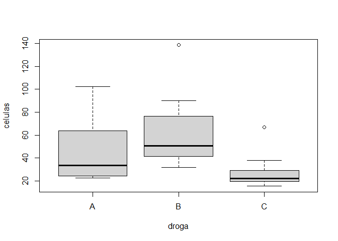

Test de Bonferroni y test de Tukey
================
Baruch Mejía Martínez
18/11/2021

Los test de Bonferroni y de Tukey se utilizan para redefinir o corregir
la significancia al hacer varias pruebas de hipótesis con error tipo I.
El objetivo es manterer controlada la probabilidad de cometer un error
tipo I, es decir, rechazar una hpótesis nula aun cuando esta es
verdadera.

Definimos multiples hipótesis nulas "*H*<sub>0</sub>: existe una
relación entre los sujetos que toman una droga *x*<sub>*i*</sub> con los
que toman la droga *x*<sub>*j*</sub>, con *i* ≠ *j*.

## Test de Bonferroni:

En el test de Bonferroni se redefine la significancia *α* para *m*
hipótesis nulas *H*<sub>0</sub>.
$$\\alpha ' = \\dfrac{\\alpha}{m}$$

``` r
alprim = 0.05/3
alprim
```

    ## [1] 0.01666667

Entonces se redefine la regla de decisión: “Para probabilidades
*p*<sub>*i*</sub> ≤ *α*′, se rechaza la hipótesis nula”

Definimos datos de un ensayo en el que se relacionen 3 drogas y cierto
contéo de células.

``` r
droga = c('A','A','A','A','A','A','A','A','A','A','A','A',
          'B','B','B','B','B','B','B','B','B','B','B','B',
          'C','C','C','C','C','C','C','C','C','C','C','C')
droga = factor(droga)
celulas = c(24.15,24.6,25.1,22.55,22.62,26.85,40.2,63.2,79.6,59.1,64.6,102.45,
            36.3,44.1,39.15,49.9,50.35,50.6,31.7,69.25,138.6,72.95,80.05,90.3,
            19.35,21.9,31.1,15.4,18.3,27.1,22.15,22.15,22.75,66.7,19.35,37.85)
datos = data.frame(droga,celulas)
show(datos)
```

    ##    droga celulas
    ## 1      A   24.15
    ## 2      A   24.60
    ## 3      A   25.10
    ## 4      A   22.55
    ## 5      A   22.62
    ## 6      A   26.85
    ## 7      A   40.20
    ## 8      A   63.20
    ## 9      A   79.60
    ## 10     A   59.10
    ## 11     A   64.60
    ## 12     A  102.45
    ## 13     B   36.30
    ## 14     B   44.10
    ## 15     B   39.15
    ## 16     B   49.90
    ## 17     B   50.35
    ## 18     B   50.60
    ## 19     B   31.70
    ## 20     B   69.25
    ## 21     B  138.60
    ## 22     B   72.95
    ## 23     B   80.05
    ## 24     B   90.30
    ## 25     C   19.35
    ## 26     C   21.90
    ## 27     C   31.10
    ## 28     C   15.40
    ## 29     C   18.30
    ## 30     C   27.10
    ## 31     C   22.15
    ## 32     C   22.15
    ## 33     C   22.75
    ## 34     C   66.70
    ## 35     C   19.35
    ## 36     C   37.85

Hacemos un test de Bonferroni

``` r
pairwise.t.test(celulas,droga,p.adj="bonf")
```

    ## 
    ##  Pairwise comparisons using t tests with pooled SD 
    ## 
    ## data:  celulas and droga 
    ## 
    ##   A      B     
    ## B 0.3323 -     
    ## C 0.1950 0.0036
    ## 
    ## P value adjustment method: bonferroni

Con el test de Bonferroni encontramos que no se rechaza la hipótesis
nula para la comparación entre las drogas A-B y A-c, por otra parte,
entra en discusión el descartar la hipótesis nula entre B-C.

## Test de Tukey:

La prueba de Tukey es un procedimiento de comparación múltiple de un
solo paso y una prueba estadística. Es un análisis post-hoc, lo que
significa que se usa junto con un ANOVA.

Permite encontrar medias de un factor que son significativamente
diferentes entre sí, comparando todos los pares de medias posibles con
un método similar a la prueba t.

Para el test de Tukey, se define la regla de decisión como: "Se rechaza
la hipótesis nula si *p* ≤ *α*

Hacemos el test de Tukey.

``` r
model <- aov(celulas~droga, data=datos)
TukeyHSD(model, conf.level=.95)
```

    ##   Tukey multiple comparisons of means
    ##     95% family-wise confidence level
    ## 
    ## Fit: aov(formula = celulas ~ droga, data = datos)
    ## 
    ## $droga
    ##          diff        lwr        upr     p adj
    ## B-A  16.51917  -8.215736  41.254069 0.2439817
    ## C-A -19.24333 -43.978236   5.491569 0.1520517
    ## C-B -35.76250 -60.497403 -11.027597 0.0033223

Encontramos valores similares pero un poco menores del valor de p que en
el test de Bonferroni. Las relaciones entre las drogas A-B y A-C no se
rechaza la hipótesis nula, mientras que para B-C se rechaza ya que
*p* &lt; 0.05 = *α*

<!-- -->

## Conclusión:

El test de Bonferroni es poderoso para un número grande de hipótesis
nulas, ya que disminuye la probabilidad de rechazar la hipótesis nula
entre mayor sea el número de hipótesis *m*, el problema es que con *m*
muy grande, la probabilidad de error tipo 1 disminuye demasiado, es por
eso que se desaconseja su uso.

Para el test de Tukey, existen pequeñas variaciones en el valor de p en
las relaciones entre grupos en comparación con el test de Bonferroni.
Pero para *m* grandes, el test de Tukey se mantiene.

Referencias: <https://rpubs.com/Joaquin_AR/236898>
